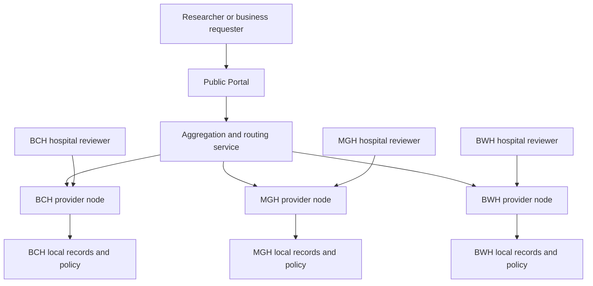
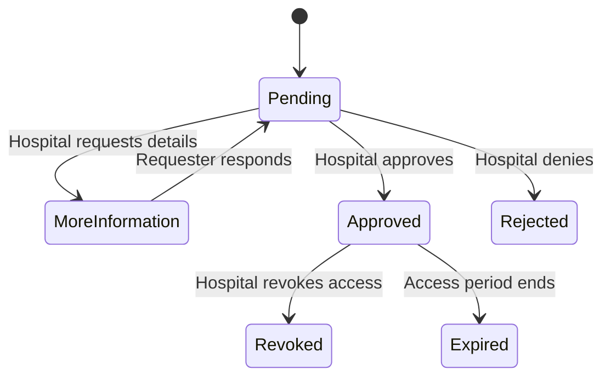

# MedBridge System Architecture

## Status

Hackathon architecture for **TOA Health Hack — DICOM Search (Red Hat)**.

MedBridge is a federated discovery and access-request prototype for medical
imaging data. It allows an education/research requester or a
business/commercial requester to search across participating hospital nodes
without centralizing raw DICOM records or direct patient identifiers. Each
hospital remains the authority for its own data and independently approves or
denies access to its de-identified patient data.

The demo uses synthetic data and simulated identities. It is privacy-aware, but
it does not claim production HIPAA compliance, SOC 2 attestation, or validated
DICOM de-identification.

## Architecture Principles

1. **Data stays with the provider.** Raw records and patient-level indexes
   remain inside each simulated hospital node.
2. **The schema is the contract.** Nodes may store data differently, but they
   accept and return the same schema-compliant query and response structures.
3. **Privacy is enforced locally first.** A node must suppress or bucket unsafe
   results before returning them. The public Portal is not the only privacy
   boundary.
4. **Hospital authority is decentralized.** Each node stores and decides its
   own access requests.
5. **Discovery and data access are separate.** Finding that relevant data
   exists never automatically grants access to it.
6. **Commercial entitlement does not override privacy.** Both requester tiers
   receive only de-identified data after hospital approval.
7. **Authorization is simulated.** The demo collects an organization name and
   requester tier, but it does not perform real institutional login, IRB
   verification, payment processing, or identity proofing.

## System Topology



The aggregation service knows where participating nodes are and fans out
schema-compliant queries. It is a coordinator, not the owner of patient data or
hospital approval decisions.

## Component Responsibilities

| Component | Responsibilities | Primary owner |
| --- | --- | --- |
| Open Schema | Define query, search-response, de-identified-data, and access-request contracts | Agnel |
| Provider-node adapter | Read local synthetic records, map them to the schema, execute local queries, and produce privacy-filtered responses | Agnel, Jaewon |
| Semantic mapping | Normalize equivalent terms and map source fields into schema concepts | Jaewon |
| Aggregation and routing | Discover nodes, fan out queries, aggregate safe responses, and route access requests back to the correct node | Justin |
| Access and privacy policy | Apply age bucketing, rare-cohort suppression, requester-tier rules, and approval-state validation | Yizhen |
| Public Portal | Search UI, aggregated results, requester form, pending-request view, and secure-pathway stub | Kelsey |
| Hospital server Portal | Node-specific queue where hospital reviewers see organization and tier and approve or deny requests | Portal/node integration |

Justin owns the boundaries between these components and the shared HTTP
contract. The provider-node adapter and access-policy module should be reusable
across all simulated hospitals.

## Two Schema Layers

### 1. Search/metadata layer

The search layer contains only the minimum information needed to discover that
a hospital has a potentially relevant dataset. It must not contain direct
patient identifiers or patient-level rows.

Candidate discovery concepts include:

- Node identifier and hospital display name
- Imaging modality
- Broad body site
- Bucketed age range
- Normalized condition category or concept
- Broad acquisition-year range
- Available data types
- Privacy-filtered cohort count
- Whether the node supports access requests

Even minimal metadata can create re-identification risk when rare conditions,
small counts, dates, locations, and demographics are combined. Search metadata
must therefore be treated as potentially sensitive until the node applies its
local disclosure policy.

Example safe node response:

```json
{
  "query_id": "query-001",
  "node_id": "BCH",
  "match": {
    "exists": true,
    "count": null,
    "display_count": "<10",
    "suppressed": true,
    "suppression_reason": "small_cohort"
  },
  "available_data": [
    "deidentified-dicom",
    "deidentified-radiology-metadata"
  ],
  "access_request_supported": true
}
```

The phrase "broadcast metadata" means that a provider node serves a
schema-compliant response to a Portal query. It does not mean that the node
periodically uploads a patient-level metadata index to a central server.

### 2. De-identified patient data layer

This layer contains the data that may become available after a hospital
approves a request. It remains at the provider node until approval and is never
part of the public search response.

For the demo, this layer:

- Contains synthetic data only
- Excludes names, patient IDs, exact birthdates, and direct identifiers
- Uses age buckets rather than exact ages or birthdates
- Avoids unnecessary exact dates and unique identifiers
- Uses normalized diagnosis categories rather than unrestricted clinical text
- Is limited to the fields explicitly defined by the open schema
- Is exposed through a gated link or retrieval stub after approval

Applying a schema transformation alone is not proof of de-identification.
Production DICOM handling would also require review of standard attributes,
private tags, free text, UIDs, overlays, burned-in annotations, and pixel data.

## Query Lifecycle

1. The requester enters a structured query such as pediatric + brain + MR.
2. The Public Portal converts the form into the open query schema.
3. Justin's aggregation service sends the same query to participating nodes.
4. Each provider-node adapter translates the query into its local data model.
5. Each node calculates its local match count.
6. Each node applies age bucketing and rare-cohort suppression locally.
7. The aggregation service combines only the privacy-filtered node responses.
8. The Portal renders an aggregate discovery result.
9. Natural-language parsing and richer ontology expansion are stretch features.

### Privacy behavior

The demo policy uses a configurable small-cohort threshold with a default of
10:

| Local count | Node response |
| ---: | --- |
| 0 | `No matches` |
| 1–9 | `Fewer than 10` and no raw count |
| 10+ | Exact count for a simulated eligible requester |

The threshold is a demo policy, not a universal HIPAA safe-harbor rule.
Suppressed raw counts must not be serialized in the HTTP response or sent to
the browser.

If one or more node responses are suppressed, the aggregation service must not
reconstruct or imply the hidden count. It may display a message such as
"Additional matches exist at one or more participating hospitals."

## Requester Model

The demo has two requester tiers:

| Tier | Demo meaning |
| --- | --- |
| `edu_research` | University, academic laboratory, nonprofit research group, or similar research requester |
| `business_commercial` | Company or other commercial requester |

Every access request includes:

- Requester name or demo user identifier
- Organization name
- Requester tier
- Contact email
- Research purpose
- Query summary
- Requested hospital node
- Requested data level

The organization name and tier are self-declared in the demo. Production
deployments would need trusted institutional identity assertions and separate
verification of research approvals and commercial entitlements.

Both tiers are limited to `deidentified` data. A commercial relationship or
future purchase does not permit identifiable data and does not bypass hospital
approval.

## Decentralized Access-Request Lifecycle



1. The requester selects a matching hospital and chooses **Request Access**.
2. The request is sent to that hospital node, not to a central approval store.
3. The node creates a request with `pending_hospital_review`.
4. The requester sees a pending page with the hospital department's general
   contact email and phone number as a manual fallback.
5. The hospital server Portal lists incoming requests and surfaces the
   organization name, requester tier, purpose, and requested data level.
6. A simulated hospital reviewer approves, rejects, or requests more
   information.
7. The provider node remains the source of truth for the request status.
8. On approval, the requester sees a secure-retrieval pathway stub for the
   de-identified patient data layer.

Hospital reviewers may act only on requests owned by their node. A requester
cannot approve their own request, and an approval can never elevate the
permitted data level above `deidentified`.

## Provider-Node FastAPI Contract

Each node should expose the same access-request interface:

```text
GET  /api/access/config
POST /api/access/requests
GET  /api/access/requests
GET  /api/access/requests/{request_id}
POST /api/access/requests/{request_id}/decision
POST /api/access/requests/{request_id}/additional-information
```

Example node routing:

```text
http://localhost:8001/api/access/...  # BCH
http://localhost:8002/api/access/...  # MGH
http://localhost:8003/api/access/...  # BWH
```

The access implementation should be packaged as a reusable FastAPI router so
that the provider-node owner can mount it without duplicating logic:

```python
app.include_router(create_access_router(node_id=HOSPITAL_NODE))
```

The access-policy package should not read raw study records. Agnel's local
search code passes a calculated count to the policy function before producing
the node's search response.

## Node Configuration

Each hospital owns its local policy and contact configuration:

```json
{
  "node_id": "BCH",
  "small_cohort_threshold": 10,
  "maximum_data_level": "deidentified",
  "access_contact": {
    "department": "Research Data Access Office",
    "email": "synthetic-bch@example.org",
    "phone": "555-0101"
  }
}
```

The demo must use synthetic department contact information unless the event
explicitly supplies approved contacts.

## Portal Views

### Public requester view

- Structured search fields
- Aggregate privacy-filtered results
- Tier selector: education/research or business/commercial
- Required organization-name field
- Access-request form
- Pending, approved, denied, or more-information status
- General hospital contact details for manual follow-up
- Gated retrieval stub after approval

### Hospital reviewer view

- Node-specific pending-request queue
- Requester organization and tier
- Research purpose and query summary
- Requested data level
- Approve, deny, and request-more-information actions
- Decision note
- Request history and current status

## Demo Sequence

1. Search for `pediatric brain MRI`.
2. The Portal fans out the query to at least two hospital nodes.
3. Each node returns a schema-valid, privacy-filtered response.
4. The Portal aggregates the safe responses.
5. At least one small cohort demonstrates suppression.
6. The requester selects a tier and enters an organization name.
7. The requester sends an access request to a specific node.
8. The hospital reviewer opens that node's queue and sees the tier and
   organization.
9. The hospital approves the request.
10. The requester status changes to approved and a de-identified retrieval stub
    becomes available.

## Demo Security and Compliance Boundaries

This prototype demonstrates architectural safeguards, not regulatory
certification:

- HIPAA is a legal and operational framework, not a feature toggle.
- SOC 2 is an independent controls examination, not a replacement for HIPAA.
- Synthetic data avoids handling real ePHI during the demo.
- Simulated identities do not establish real institutional affiliation.
- Small-count suppression reduces one disclosure risk but does not prove
  de-identification.
- Production adoption would require institutional policy review, security risk
  analysis, access logging, incident response, identity federation, durable
  storage, DICOM-specific de-identification validation, contracts, and
  ongoing monitoring.

The mentor session bounds the demo assumptions; it does not resolve production
compliance.

## Explicit Non-Goals for the Hackathon

- Real institutional SSO
- Real IRB or research-authorization verification
- Payment processing
- Transfer of real medical records
- Production DICOM de-identification
- Central patient-level metadata indexing
- Differential privacy claims
- Cross-hospital patient identity matching
- Production-grade persistence or audit infrastructure

## Post-Hackathon Production Direction

A production version would replace simulated components with:

- Trusted institutional identity federation
- Signed access tokens and node-scoped reviewer permissions
- Persistent node-local request and audit stores
- Query-rate limits and differencing-attack detection
- Expert-reviewed de-identification profiles
- Secure aggregation for privacy-sensitive counts
- Data-use agreements and computable consent/purpose restrictions
- Time-limited, revocable retrieval credentials
- Monitoring, incident response, and formal security controls
